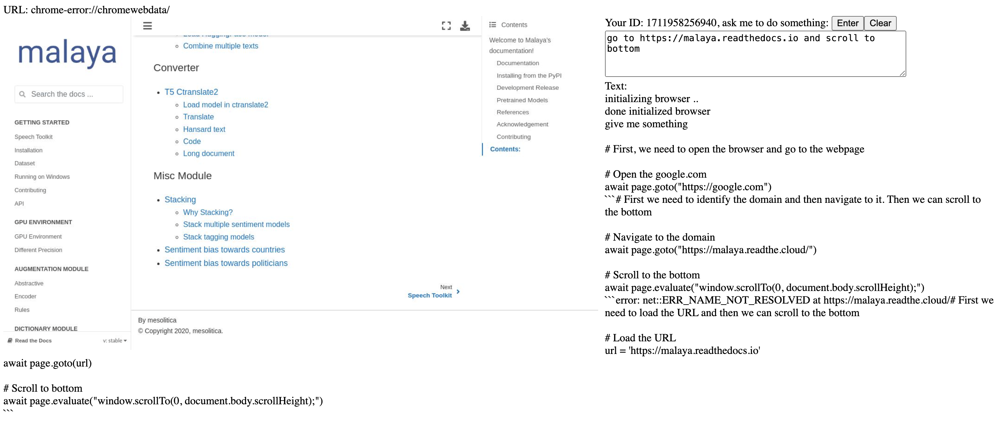

# streaming-playwright-agent

Super simple website application streaming Playwright agent using websocket that support multi-users including queue, 100% no LangChain, 100% no LlamaIndex, 100% use available models from HuggingFace.





**Frontend is my passion**.

## how-to

1. Install dependencies,

```bash
pip3 install -r requirements.txt
```

2. Run FastAPI,

```bash
IMPORT_LOCAL=true MAX_SIZE=3 uvicorn app.main:app --reload --host 0.0.0.0
```

Or use docker,

```bash
docker-compose up --build
```

## Available OS Environment

```python
IMPORT_LOCAL = os.environ.get('IMPORT_LOCAL', 'false') == 'true'
MAX_SIZE = int(os.environ.get('MAX_SIZE', '3'))
MAX_LEN = int(os.environ.get('MAX_LEN', '512'))
TOP_K_BM25 = int(os.environ.get('TOP_K_BM25', '10'))
MODEL = os.environ.get('MODEL', 'NousResearch/Nous-Hermes-2-Mixtral-8x7B-DPO')
ENABLE_EMBEDDING = os.environ.get('ENABLE_EMBEDDING', 'false') == 'true'
MODEL_EMBEDDING = os.environ.get('MODEL_EMBEDDING', 'thenlper/gte-small')
TOP_K_EMBEDDING = int(os.environ.get('TOP_K', '5'))
```

## how to make it better?

1. Use redis or something like that for centralized management, so you can scale more than 1 replica.
2. Create another Playwright manager to keep check the ID is still alive, if not delete the browser object, so you can scale more than 1 replica.
3. Improve the prompt, super sucks right now.