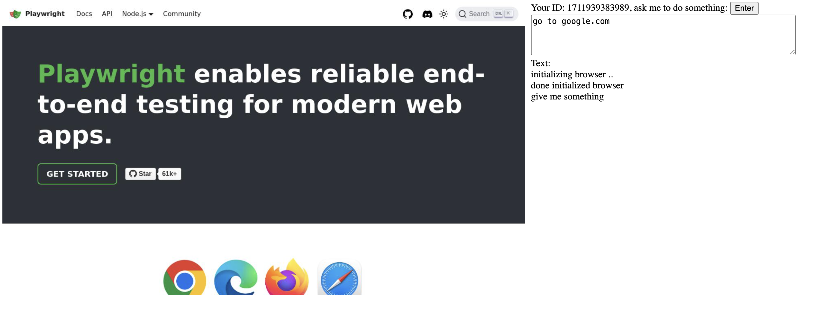

# streaming-playwright-agent

Super simple streaming Playwright agent using websocker including queue.



**Frontend is my passion**.

## how-to

1. Install dependencies,

```bash
pip3 install -r requirements.txt
```

2. Run FastAPI,

```bash
MAX_SIZE=3 uvicorn app.main:app --reload --host 0.0.0.0
```

Or use docker,

```bash
docker-compose up --build
```

## how to make it better?

1. Use redis or something like that for centralized management.
2. Improve the prompt.